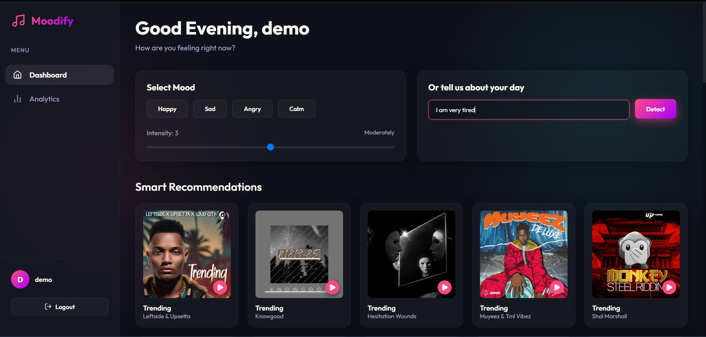
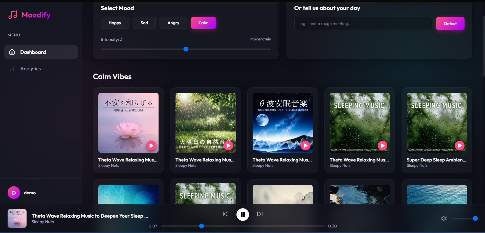
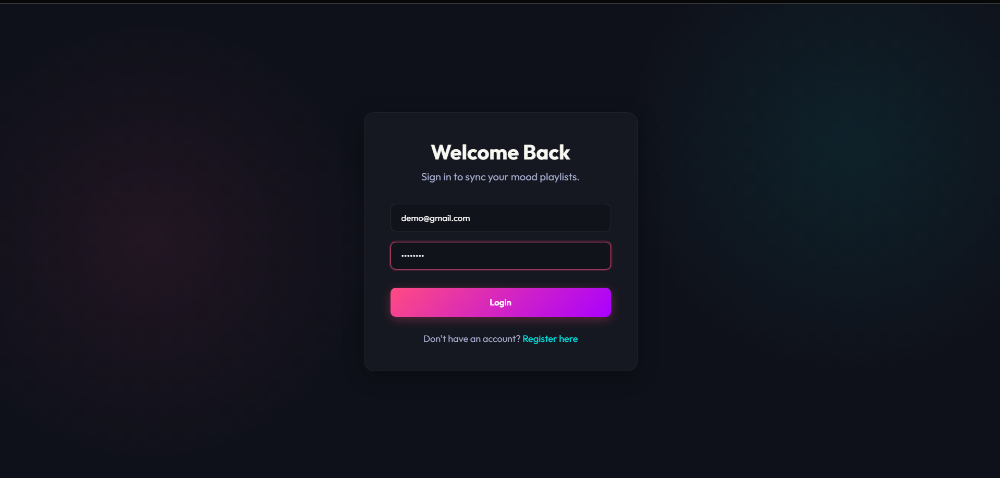
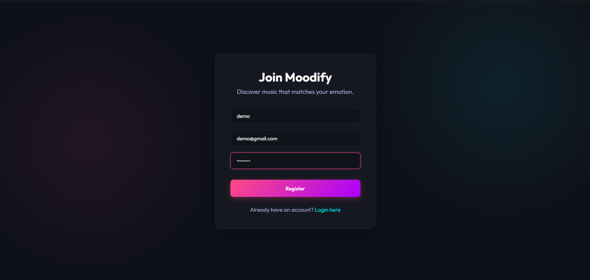

# 🎵 Moodify

### Emotion-Based Music Recommendation Platform

Moodify is a full-stack music recommendation web application that recommends music based on the user's current mood. Users can select a mood or describe how they are feeling through text, and the application generates personalized recommendations.

The recommendation process considers **mood, intensity, listening history, and time of day**.

---

## ✨ Features

* 🔐 User registration and login with JWT authentication
* 🧠 Rule-based mood detection from text input
* 🎚️ Mood intensity detection
* 🎵 Mood-based music recommendations
* 📚 Recently played / listening history
* ▶️ Music player with playback controls
* 📊 Mood and listening analytics
* 🔎 Music search using the iTunes Search API
* 👤 User-specific data and recommendations

---

## 🧠 How It Works

```text
User Input
    ↓
Mood Detection
    ↓
Mood + Intensity
    ↓
Listening History + Time of Day
    ↓
Recommendation Logic
    ↓
Personalized Music
```

Mood detection uses a **rule-based keyword matching approach**. The input text is analyzed for predefined mood and intensity keywords to determine the user's current mood.

---

## 🛠️ Tech Stack

**Frontend**

* React.js
* TypeScript
* Vite
* HTML5 / CSS3

**Backend**

* Node.js
* Express.js
* TypeScript
* REST APIs

**Database**

* MongoDB
* Mongoose

**Authentication**

* JWT
* bcrypt

**External API**

* iTunes Search API

---

## 🏗️ Architecture

```text
React + TypeScript
        ↓
Node.js + Express
        ↓
     REST APIs
       ↙   ↘
 MongoDB   iTunes API
```

---

## 📸 Screenshots

### Dashboard



### Recommendations



### Login



### Registration



---

## 📂 Project Structure

```text
Moodify/
├── backend/
│   └── src/
│       ├── config/
│       ├── controllers/
│       ├── middlewares/
│       ├── models/
│       ├── routes/
│       ├── services/
│       └── types/
│
├── frontend/
│   └── src/
│       ├── api/
│       ├── components/
│       ├── contexts/
│       └── pages/
│
├── screenshots/
├── .gitignore
└── README.md
```

---

## ⚙️ Setup

### Clone

```bash
git clone https://github.com/ashvinder2005/Moodify.git
cd Moodify
```

### Backend

```bash
cd backend
npm install
```

Create a `.env` file:

```env
MONGO_URI=your_mongodb_connection_string
JWT_SECRET=your_jwt_secret
```

Run the backend:

```bash
npm run dev
```

### Frontend

Open another terminal:

```bash
cd frontend
npm install
npm run dev
```

---

## 🚀 Future Improvements

* ML-based emotion classification
* More advanced recommendation algorithms
* Cloud deployment
* Improved playlist experience
* More personalized recommendations using long-term listening patterns

---

## 👨‍💻 Author

**Ashvinder Sharma**

[GitHub](https://github.com/ashvinder2005) • [LinkedIn](https://www.linkedin.com/in/ashvinder-sharma-ab693b289/)
